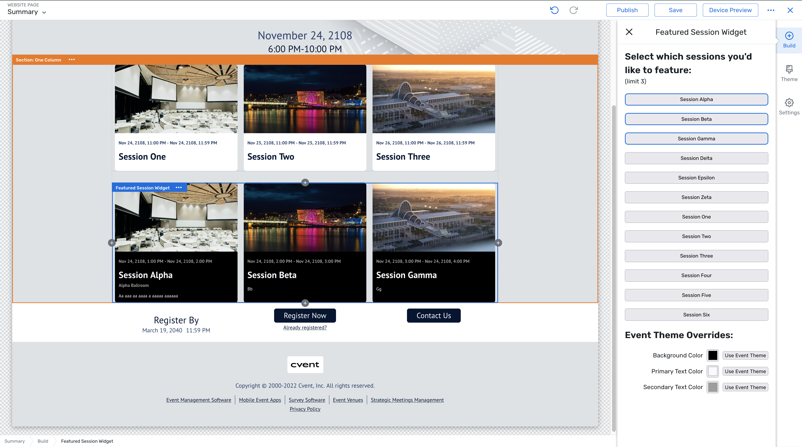

# The Featured Session Widget

Browse the code [here](https://github.com/cvent/custom-widgets-labs/tree/main/examples/FeaturedSessionWidget)

This custom widget prominently displays up to 3 sessions on the registration site.

The widget element defined in `src/index.js` displays information about each of the featured sessions. The widget uses elements from the site wide theme, as well as custom "theme overrides" (that only apply to that particular widget) specified by the planner. These theme overrides, as well as an array of session ids that specify the featured sessions, are passed to the widget via its configuration object.

The Editor element defined in `configuration/index.js` implements a custom UI for the planner that provides them with controls to edit the configuration of the featured session widget.

The below image shows the Featured Session widget element appearing twice in the Site Designer canvas. The editor element appears in the panel on the right.

